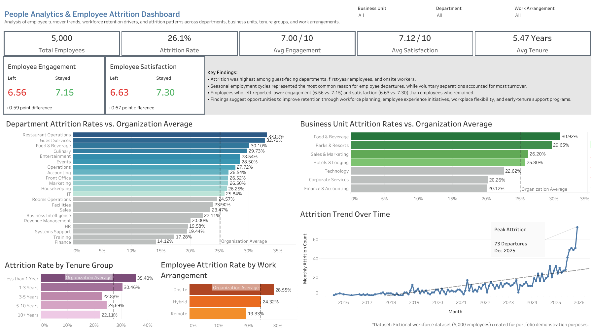

# People Analytics & Employee Attrition Analysis
## Project Overview

This project explores employee attrition and workforce retention trends using a fictional dataset of 5,000 employee records. SQL was used to analyze turnover patterns across departments, business units, tenure groups, work arrangements, employee engagement, satisfaction, separation types, and manager-level performance. Findings were visualized in an interactive Tableau dashboard designed to support data-driven workforce planning and retention strategies.

## Disclaimer

This project was created for portfolio and educational purposes using a fictional workforce dataset. All employee records, departments, business units, managers, and attrition events are simulated and do not represent any real organization or individuals.

### Tools Used
- SQL (SQLite)
- Tableau
- Excel

### Business Questions
1. 

### Key Findings
- 

### Recommendations
- 

### Tableau Dashboard

View Interactive Dashboard:

[Tableau Public Dashboard](https://public.tableau.com/app/profile/haley.huitt/viz/PeopleAnalyticsEmployeeAttritionDashboard/Dashboard1)

